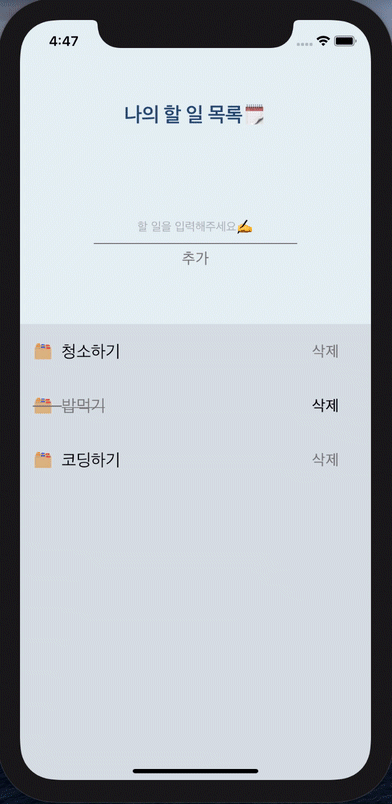

#  🗓[React-Native] Todo-List🗓
*리액트 네이티브로 구현한 ios기반 Todo List 미니 앱 서비스입니다.*



## Table of contents
1. [Feature](#feature)
2. [How to use](#how-to-use)
3. [How to run](#how-to-run)
4. [Tech Stack](#tech-stack)
7. [Logs](#logs)
8. [Comment](#comment)
---
## 📌 Feature
1. 할 일을 추가하거나 삭제할 수 있고 목록을 확인 할 수 있습니다.
2. 완료한 일을 표시 할 수 있습니다.
---
## 🎯 How to use
- **할 일 추가/삭제/완료**
  - 앱 첫 화면 상단에서 할 일을 입력하고 `추가` 버튼을 누르면 할 일을 추가 할 수 있습니다.
  - 빈 입력창에서 `추가` 버튼을 누르면 등록 할 수 없다는 알림메세지가 보입니다.
  - 할 일 오른쪽에 `삭제` 버튼을 누르면 할 일을 삭제 할 수 있습니다.
  - 완료한 일을 눌러서 표시 할 수 있습니다.
- **할 일 목록 확인**
  - 앱을 종료 한 후 다시 실행하여도 등록한 할일 목록을 확인 할 수 있습니다.
---
## 🏃‍♀️ How to run

- **Installation**

  ```
  cd ios
  pods install

  //template
  npm install
  npm run ios

  ```

1. ios 디렉토리에서 pods install을 통해 패키지를 설치합니다.
2. npm install을 통해 패키지를 설치합니다.
3. 터미널에서 `npm run ios` 로 실행을 확인할 수 있습니다.

---

## 💻 Tech Stack

- **Client**
  - TypeScript
  - React-native
  - Redux (Reduxjs/toolkit)
  - Redux-thunk
  - Eslint
  - Jest and Enzyme

---

## ✍️ Logs
- ### 초기 빌딩이 쉬운 Expo CLI 대신 React-Native CLI를 선택한 이유
  지난 프로젝트에서는 상대적으로 진입장벽이 낮은 Expo CLI를 이용하여 빠르게 초기 빌드를 하여 진행하였기에 이번에도 짧은 시간내에 구현하기 위해 고민을 했지만 결과적으로 자유도와 확장성이 높은 React-Native CLI 방식으로 앱 빌드를 해보는 것이 더 나은 방향이라 생각을 하였습니다.
  하지만 초기 설정부터 앱이 실행되지 않는 문제가 발생하였습니다. 서치 결과 podfile 안에 설정된 버전문제임을 알았고 버전을 명시해줌으로써 문제가 해결되었습니다. 외에도 빌드 단계에서 조금 버벅였지만 현업에서 더 많이 사용되는 React-Native CLI를 통해 앱을 빌드 할 수 있어 좋은 경험이자 React-Native CLI로 앱 구현을 시작할 수 있는 계기가 되었습니다.

- ### AsyncStorage 와 Redux-Thunk
  서버 없이 데이터를 저장하기 위해 웹의 localStorage와 비슷한 리액트 네이티브의 AsyncStorage를 사용하였습니다.과제는 기능이 많지 않아 데이터의 양도 상대적으로 적기 때문에 AsyncStorage로 서버를 대체 할 수 있지만 실서비스에서도 사용이 가능한지 궁금하였습니다. 결과적으로 서버를 완전히 대체한다는 것은 불가하지만 최적화를 통해 localStorage와 비슷한 수준의 속도로 만들어 실 사용에도 사용 할 수 있음을 알게되었습니다. AsyncStorage의 하나의 객체에 일정 데이터가 쌓이면 다음 객체를 만들어 총 데이터의 개수를 줄이는 방식으로 객체의 키와 데이터 키를 map구조에 저장하여 관리하기, 데이터 처리 횟수를 최소화 하기 위해 큐에 요청을 담아두었다가 한번에 처리하기, 메모리 캐싱하기 등 다양한 최적화 방법으로 성능을 향상시키는 방법이 있었습니다. 프로젝트의 규모가 커진다면 꼭 고려해야 할 사항이라고 생각했습니다.

  또한 프로젝트의 확장성을 생각하여 Redux-Thunk를 사용하여 비동기 요청에 대한 비즈니스 로직을 분리하였습니다. 규모가 작은 앱에서도 비즈니스 로직을 분리함으로써 코드가 굉장히 간결해져 가독성이 좋아졌음을 느꼈습니다.

---

## 💡 Comment
  지난 프로젝트를 할 때는 expo CLI를 사용하였지만 이번 과제를 통해 React-Native ClI를 이용하여 앱 빌드를 시도할 수 있어 좋았습니다. 미숙하게나마 Typescript를 함께 적용하면서 초기 설정 단계에서 헤매었지만 직접 환경을 셋팅하면서 React-Native CLI로 앱을 만드는 기본 단계를 공부 할 수 있는 기회였습니다. 요구하는 기능이 많지 않았지만 프로그래밍의 기본 기능인 만큼 중요한 추가/삭제/업데이트를 구현하면서 가장 나은 방법인지 의구심을 갖고 기초를 다지며 재밌게 과제를 할 수 있었습니다. 비록 전형을 위한 과제였지만 저에게 많은 도움이 되었던 과제 였습니다. 감사합니다.😀
